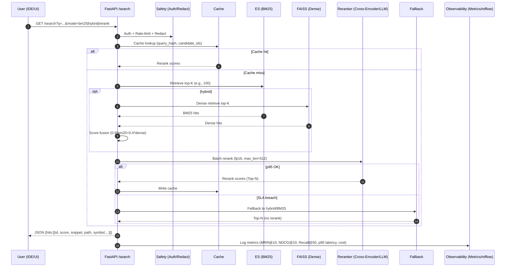

# LLM Reranker for Code/Document Search

A lightweight, production-lean reranking layer that boosts the relevance of search results in large codebases and knowledge repos. It sits on top of your existing search (BM25/OpenSearch/Elasticsearch) and reorders the top‑K candidates using an LLM/cross‑encoder for better precision at the top.

---

## Objectives / KPIs

* **Quality:** +10–20% **MRR\@10 / NDCG\@10** over BM25 baseline.
* **Latency:** p95 ≤ **2s** (API) or **≤ 800ms** (local GPU) at K ∈ {50,100}.
* **Cost:** ≤ **\$0.01/query** or comparable local GPU time.
* **Safety:** No sensitive tokens/keys in logs or model inputs.

---

## Architecture (High Level)

```mermaid
flowchart TB
  %% ======= CLIENT LAYER =======
  subgraph C[Client & Entry]
    UI["Dev Portal / CLI / IDE"]
    API["FastAPI /search"]
    A_B["A/B Toggle<br/>bm25&#124;hybrid&#124;rerank"]
    A_B --> NEXT["Next"]
  end

  %% ======= SAFETY & CONTROL =======
  subgraph G[Guardrails & Control]
    REDACT["Secret Redaction<br/>(keys, tokens, creds)"]
    RATE["Rate-limit & Auth<br/>(tenant/ACL optional)"]
    CACHE["Cache<br/>(query_hash, candidate_ids -&gt; rerank scores)"]
    TIMEOUT["Timeout + SLA Fallback<br/>(if slow -&gt; return hybrid/BM25)"]
  end

  %% ======= RETRIEVAL LAYER =======
  subgraph R[Retrieval]
    subgraph IDX[Indexing]
      ING["Ingest &amp; Chunk<br/>• Code-aware splitter (func/class)<br/>• Doc splitter (headings, 800–1500 tokens)<br/>• Metadata: repo, path, language, symbol, heading"]
      ES[(OpenSearch/Elasticsearch<br/>BM25)]
      FAISS[(FAISS Dense Index<br/>MiniLM/mpnet)]
      CONF[conf/index.yaml]
    end
    RETRIEVE["Retrieve Top-K (50–200)"]
    FUSE["Score Fusion<br/>0.6*bm25 + 0.4*dense"]
  end

  %% ======= RERANKER LAYER =======
  subgraph RR[Reranker]
    BATCH["Batcher (32/64), fp16,<br/>max_len=512"]
    CE["bge-reranker-base<br/>(or LLM API)"]
    RTOP["Return Top-N (e.g., 10)<br/>+ snippets, path, symbol"]
  end

  %% ======= EVALUATION & OBS =======
  subgraph EVAL[Evaluation &amp; Ops]
    METRICS["MRR@10, NDCG@10, Recall@50<br/>Latency p50/p95, Cost/query"]
    QRELS[qrels.tsv -labels]
    DSETS["CodeSearchNet subset &amp;<br/>internal doc samples"]
    MLFLOW[(mlflow runs)]
    LOGS["Query Logs &amp; Difficult-Query Miner"]
  end

  %% ======= FLOW =======
  UI --> API --> A_B
  A_B --> RATE --> REDACT --> CACHE
  CACHE -->|miss| RETRIEVE
  CACHE -->|hit| RTOP

  ING --> ES
  ING --> FAISS
  CONF --> ES

  RETRIEVE --> ES
  RETRIEVE --> FAISS
  ES --> FUSE
  FAISS --> FUSE
  FUSE --> RR

  RR --> BATCH --> CE --> RTOP
  RTOP --> CACHE

  %% SLA and fallback
  CE --> TIMEOUT
  TIMEOUT -->|slow| FUSE

  %% Eval wiring
  API -.-> METRICS
  METRICS --> MLFLOW
  QRELS --> METRICS
  DSETS --> METRICS
  LOGS --> METRICS
```



---

## Request Flow (with timing & choices)



---

## Repository Layout

```
llm-reranker/
  data/                 # toy eval sets (queries.tsv, qrels.tsv)
  src/
    ingest.py           # load, chunk, index (ES/OpenSearch)
    retrieve.py         # BM25 + (optional) dense retrieval
    rerank.py           # cross-encoder/LLM rerank
    eval.py             # MRR/NDCG/Recall computation
    api.py              # FastAPI /search endpoint
  conf/
    index.yaml          # analyzers, fields, mappings
    eval.yaml           # k, metrics, batches, splits
  notebooks/            # quick EDA/labeling helpers
  README.md
  requirements.txt
```


## Authors

- Snehith Kongara
- Sai Teja Kusireddy


---

## License

MIT License – see LICENSE for details.
